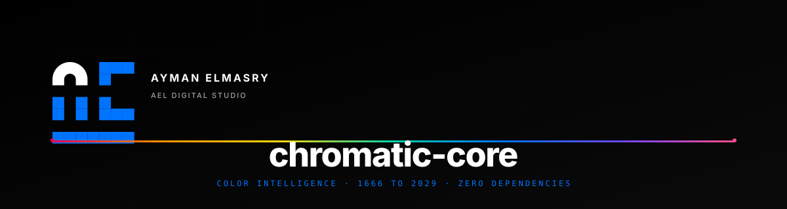

# 🎨 chromatic-core

**A sovereign color intelligence engine — from Newton (1666) to 2029+**

**Built by Ayman Elmasry · AEL Digital Studio**

---

## 🎯 Overview

A **5-layer color intelligence engine** for professionals.

| Layer | Purpose |
|---|---|
| **0. Core** | Color math · 15+ spaces |
| **1. Philosophy** | Newton → Goethe → Munsell |
| **2. Probability** | Bayesian · Markov |
| **3. Logic** | Color algebra · Predicates |
| **4. Application** | Timeline · Palettes · Export |

---

## 📬 Contact

**Ayman Elmasry** — AEL Digital Studio
- 📧 ayman@aymanelmasry.me
- 🌐 aymanelmasry.com

© 2025 Ayman Elmasry
